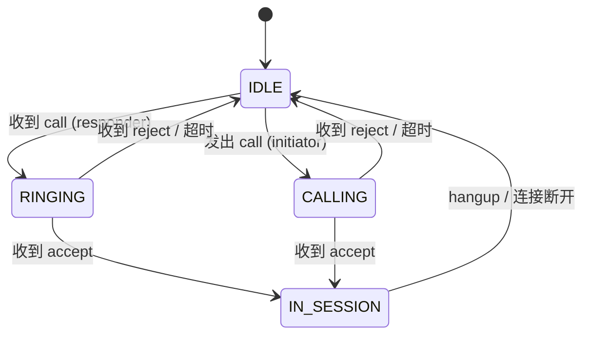
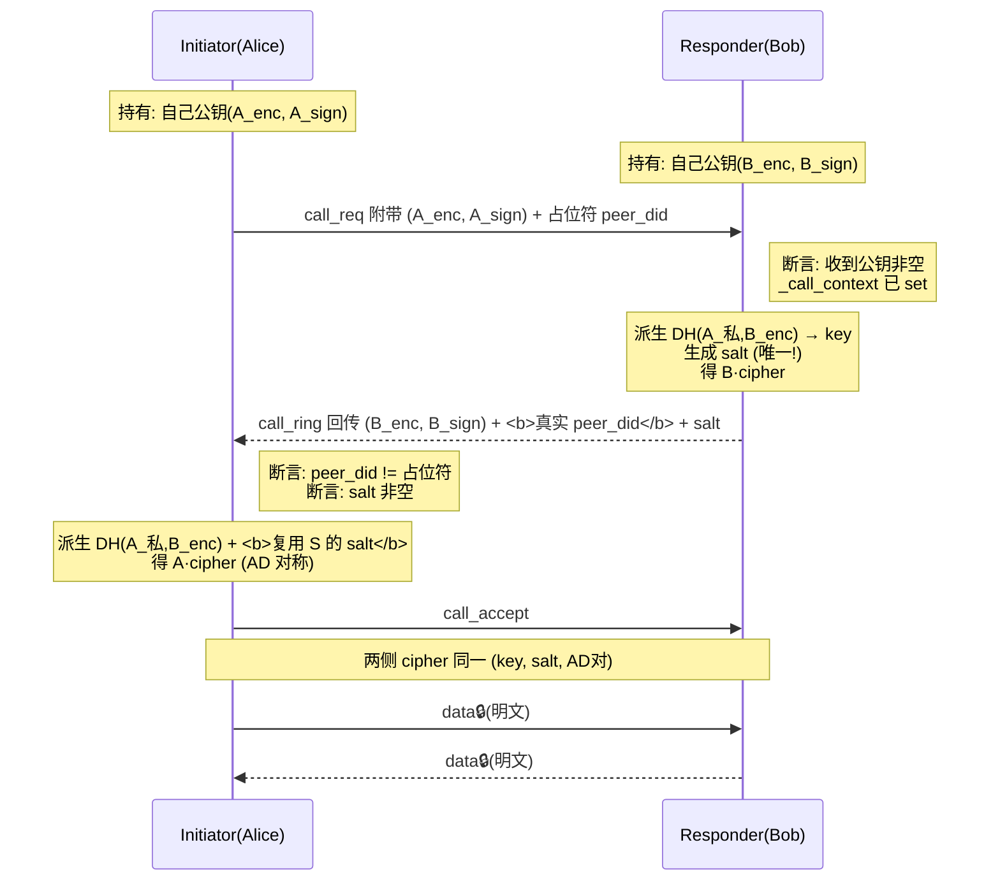

# AgentLink 协议状态机 · 正式版 v1

> 对应缺口：**协议状态机（解决"不对称"）**
> 参考：WebRTC SDP 握手（offer/answer/ice-candidate）的状态转换思想——每个消息只有在特定状态才合法。
> 作用域：p1.py 的 HTTP 回调 + secure_session.py 的加密协商（当前正式跨机链路）。

---

## 一、为什么需要状态机

AgentLink 曾出现的 5 个真 bug，**4 个本质是"状态不对称"**：

| Bug | 本质 | 状态机解法 |
|:--|:--|:--|
| 前缀收发不对称（🔒解密失败） | 发送端加密、接收端不剥前缀 | 不变量断言：`payload.startswith("🔒") == is_encrypted` |
| AD/DID 绑定不对称（跨机必踩） | initiator 用占位符 DID，AEAD 按排序 DID 对绑定 | ring 必须回传**真实** peer_did，且必须在 encrypt 前断言已解析 |
| 静默明文降级（最危险） | `_call_context` 全仓无人赋值，一直明文 fallback 不报错 | 断言：`call_context` 必须在 encrypt 前已 set |
| 异步回调没 await | on_ring/on_data/on_accept 同步调用 | 回调显式 `Awaitable | None` |

**核心原则（对齐 WebRTC）：消息语义由"当前状态"决定，非法状态下的消息必须报错或显式降级，绝不静默。**

---

## 二、状态定义

每个 `AgentLinkState` 处于以下离散状态之一：



| 状态 | 含义 | 谁持有公钥 | 谁持有 salt |
|:--|:--|:--|:--|
| `IDLE` | 无会话 | initiator: **自己的**公钥 + 对端目标DID（可能是占位符） | 无 |
| `CALLING` | initiator 已发 call，等 ring | initiator: 已把**自己的**公钥随 call 发出 | 无（还没拿到） |
| `RINGING` | responder 已收 call | responder: 拿到 **initiator 公钥**；initiator: 等 ring 回传 responder 公钥 | responder: **生成 salt**（HMAC随机） |
| `IN_SESSION` | 双向已通 | **两侧都有对方公钥** | **两侧共享同一个 salt** |

---

## 三、消息 ↔ 合法状态映射

| 消息 | 合法发送状态 | 合法接收状态 | 非法时行为 |
|:--|:--|:--|:--|
| `call_req` | IDLE | IDLE | 已在会话中 → 拒绝（busy） |
| `call_ring`(响应) | （服务器中介） | CALLING | CALLING 状态收到 → 正常；否则忽略或报错 |
| `call_accept` | IDLE(responder 收 call 后) | CALLING | CALLING 收到 → 进 IN_SESSION |
| `call_reject` | IDLE(responder) | CALLING | CALLING 收到 → 回 IDLE |
| `data_frame` | IN_SESSION | IN_SESSION | 非 IN_SESSION 收到数据 → **丢弃并告警**（防重放/乱序）|
| `heartbeat` | IN_SESSION | IN_SESSION | 非会话 → 静默忽略 |
| `hangup` | IN_SESSION / RINGING / CALLING | 任意 | 清状态回 IDLE |

---

## 四、加密协商状态机（公钥 + salt 归属）

这是"不对称"的核心。两侧的密钥状态必须严格对称，否则 AEAD 校验失败。



### 谁该有公钥（权威归属）
| 阶段 | 公钥来源 |
|:--|:--|
| initiator 的 **B_enc/B_sign** | **只能**来自 ring 响应（`resp_extra`） |
| responder 的 **A_enc/A_sign** | call_req body（`_call_context`） |

### 谁该有 salt（关键——避免旧 bug）
- **salt 由 responder 在 ring 阶段唯一生成**，回传 initiator。
- initiator **不得自行生成新 salt**（旧降级路径已标记"降级: 无共享 salt"）。
- 两侧必须**复用同一个 salt**，否则 AES-GCM 解密失败。

### 谁该有真实 DID
- initiator 初始 `peer_did` 是**占位符**（如 `did:wba:IP-port`）。
- **ring 响应必须回传 responder 真实 `peer_did`**（p1.py 415 后的 resp_extra 已做）。
- **在 encrypt 之前必须把 peer_did 覆盖为真实值**，否则 AEAD 排序绑定错。

---

## 五、不变量（配合作业3断言）

1. **call_context 前置**：任何 encrypt/decrypt 前，`_call_context` 已 set（含对方公钥）。
2. **DID 已解析**：encrypt 前 `peer_did != "placeholder"`（必须真实）。
3. **前缀 ↔ 加密一致性**：`payload.startswith("🔒") == is_encrypted` 恒成立。
4. **salt 唯一性**：单会话只有一个 salt，initiator 复用，不重生成。
5. **AD 对称**：两侧 `cipher.ad()` 相等（selftest 已验证）。

---

## 六、落地检查单（作业3断言对应）

```python
# 位置: secure_session.py 关键路径
assert state._call_context, "call_context must be set before encrypt"
assert state.peer_did != "placeholder", "DID must be resolved before ring"
assert payload.startswith("🔒") == is_encrypted, "prefix/encryption invariant broken"
```

> 文档对应源码：agentlink_p1.py（状态流转） + agentlink/secure_session.py（加密协商）。
